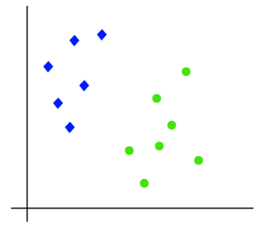
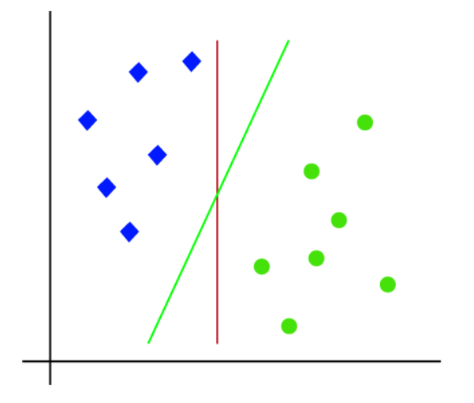
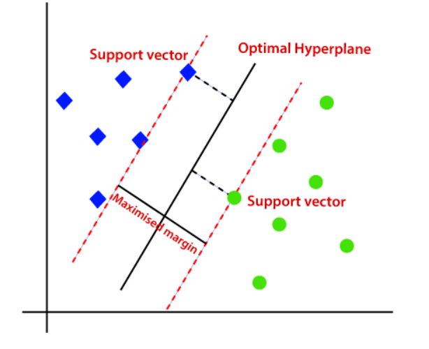
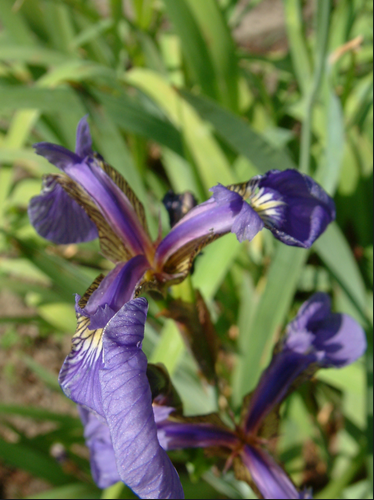
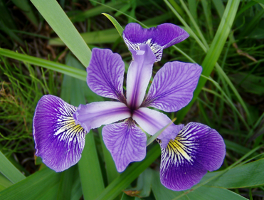
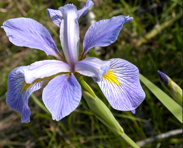
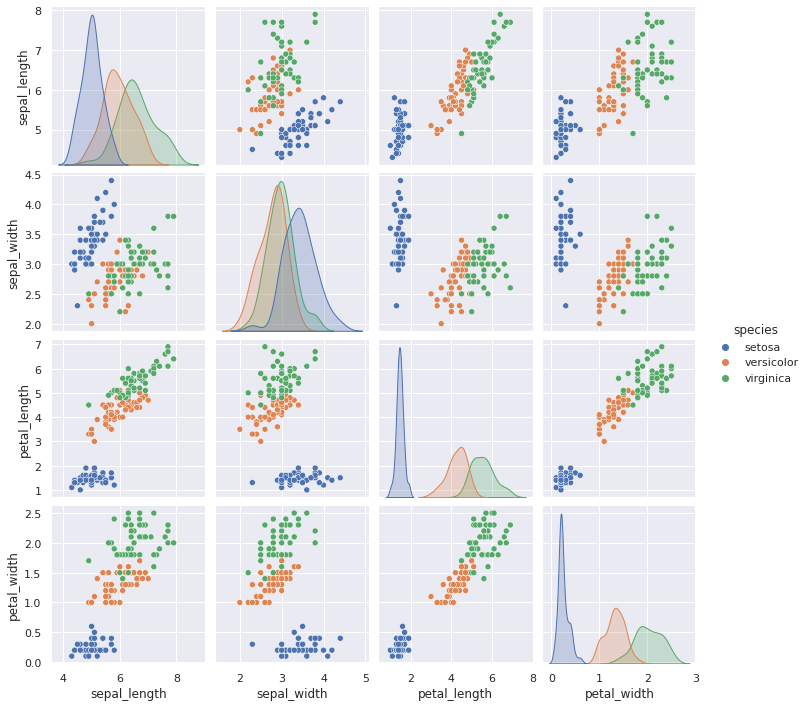
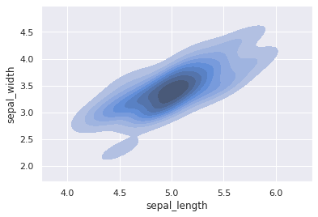

<h1>Support Vector Machines(SVM)</h1><hr><br>
SVM is a powerful algorithm which can be used on classified data, to predict the class of the data based on its attributes. It works by creating a boundary between the various classes of data.

<br>
First we create the margins based on the data

<br>
Then we create an optimal hyperplane, keeping the closed vectors(points) towards the boundary as the support vectors


### The Data
We will use the famous [iris flower data set](http://en.wikipedia.org/wiki/Iris_flower_data_set) to demonstrate this algorithm. It consists of various dimensions of the sepals and petals of 3 types of iris flowers.
<ol>
    <li>The Setosa<br></li>
    <li>The Versicolor<br></li>
    <li>The Virginica<br></li>
</ol>

### Imports and getting the data


```python
import pandas as pd
import numpy as np
import matplotlib.pyplot as plt
import seaborn as sns
%matplotlib inline
```


```python
iris = sns.load_dataset('iris')
```


```python
iris.info()
```

    <class 'pandas.core.frame.DataFrame'>
    RangeIndex: 150 entries, 0 to 149
    Data columns (total 5 columns):
     #   Column        Non-Null Count  Dtype  
    ---  ------        --------------  -----  
     0   sepal_length  150 non-null    float64
     1   sepal_width   150 non-null    float64
     2   petal_length  150 non-null    float64
     3   petal_width   150 non-null    float64
     4   species       150 non-null    object 
    dtypes: float64(4), object(1)
    memory usage: 6.0+ KB


```python
iris.head()
```


<div>
<style scoped>
    .dataframe tbody tr th:only-of-type {
        vertical-align: middle;
    }

    .dataframe tbody tr th {
        vertical-align: top;
    }

    .dataframe thead th {
        text-align: right;
    }
</style>
<table border="1" class="dataframe">
  <thead>
    <tr style="text-align: right;">
      <th></th>
      <th>sepal_length</th>
      <th>sepal_width</th>
      <th>petal_length</th>
      <th>petal_width</th>
      <th>species</th>
    </tr>
  </thead>
  <tbody>
    <tr>
      <th>0</th>
      <td>5.1</td>
      <td>3.5</td>
      <td>1.4</td>
      <td>0.2</td>
      <td>setosa</td>
    </tr>
    <tr>
      <th>1</th>
      <td>4.9</td>
      <td>3.0</td>
      <td>1.4</td>
      <td>0.2</td>
      <td>setosa</td>
    </tr>
    <tr>
      <th>2</th>
      <td>4.7</td>
      <td>3.2</td>
      <td>1.3</td>
      <td>0.2</td>
      <td>setosa</td>
    </tr>
    <tr>
      <th>3</th>
      <td>4.6</td>
      <td>3.1</td>
      <td>1.5</td>
      <td>0.2</td>
      <td>setosa</td>
    </tr>
    <tr>
      <th>4</th>
      <td>5.0</td>
      <td>3.6</td>
      <td>1.4</td>
      <td>0.2</td>
      <td>setosa</td>
    </tr>
  </tbody>
</table>
</div>


```python
iris["species"].value_counts()
```


    setosa        50
    versicolor    50
    virginica     50
    Name: species, dtype: int64


### Visualizing the data


```python
sns.set_theme(style="darkgrid")
```


```python
sns.pairplot(data=iris,hue="species")
```


    <seaborn.axisgrid.PairGrid at 0x7ff498f6b190>


    

    


```python
# KDE Plot of setosa's sepal length vs sepal width
setosa = iris[iris["species"] == "setosa"]
sns.kdeplot(data=setosa,x="sepal_length",y="sepal_width",shade=True)
```


    <AxesSubplot:xlabel='sepal_length', ylabel='sepal_width'>


    

    


## Splitting the data


```python
from sklearn.model_selection import train_test_split
```


```python
X = iris.drop("species",axis=1)
y = iris["species"]
X_train, X_test, y_train, y_test = train_test_split(X, y, test_size=0.33)
```


```python
y
```


    0         setosa
    1         setosa
    2         setosa
    3         setosa
    4         setosa
             ...    
    145    virginica
    146    virginica
    147    virginica
    148    virginica
    149    virginica
    Name: species, Length: 150, dtype: object


### Model Creation


```python
from sklearn.svm import SVC
```


```python
svc_model = SVC()
# C=1.0,
#     kernel='rbf',
#     degree=3,
#     gamma='scale',
#     coef0=0.0,
#     shrinking=True,
#     probability=False,
#     tol=0.001,
#     cache_size=200,
#     class_weight=None,
#     verbose=False,
#     max_iter=-1,
#     decision_function_shape='ovr',
#     break_ties=False,
#     random_state=None,
```


```python
svc_model.fit(X_train,y_train)
```


    SVC()


```python
pred = svc_model.predict(X_test)
```

## Confusion Matrix and Classification Report


```python
from sklearn.metrics import confusion_matrix,classification_report
```


```python
print(confusion_matrix(pred,y_test))
```

    [[19  0  0]
     [ 0 10  1]
     [ 0  1 19]]


```python
print(classification_report(pred,y_test))
```

                  precision    recall  f1-score   support
    
          setosa       1.00      1.00      1.00        19
      versicolor       0.91      0.91      0.91        11
       virginica       0.95      0.95      0.95        20
    
        accuracy                           0.96        50
       macro avg       0.95      0.95      0.95        50
    weighted avg       0.96      0.96      0.96        50
    


From the confusion matrix and the classification report, it is clear that the SVC model is accurate as is. However, we shall attempt to use GridSearch, and modify the C and gamma attributes for generating the SVC model.

### Using GridSearch


```python
from sklearn.model_selection import GridSearchCV
```


```python
param_grid = {'C':[0.1,1,10,100,1000],'gamma':[1,0.1,0.01,0.001,0.0001]}
grid = GridSearchCV(SVC(),param_grid,refit=True,verbose=3)
```


```python
grid.fit(X_train,y_train)
```

    Fitting 5 folds for each of 25 candidates, totalling 125 fits
    [CV 1/5] END ....................C=0.1, gamma=1;, score=0.950 total time=   0.0s
    [CV 2/5] END ....................C=0.1, gamma=1;, score=0.950 total time=   0.0s
    [CV 3/5] END ....................C=0.1, gamma=1;, score=0.900 total time=   0.0s
    [CV 4/5] END ....................C=0.1, gamma=1;, score=0.900 total time=   0.0s
    [CV 5/5] END ....................C=0.1, gamma=1;, score=0.850 total time=   0.0s
    [CV 1/5] END ..................C=0.1, gamma=0.1;, score=0.800 total time=   0.0s
    [CV 2/5] END ..................C=0.1, gamma=0.1;, score=0.850 total time=   0.0s
    [CV 3/5] END ..................C=0.1, gamma=0.1;, score=0.800 total time=   0.0s
    [CV 4/5] END ..................C=0.1, gamma=0.1;, score=0.750 total time=   0.0s
    [CV 5/5] END ..................C=0.1, gamma=0.1;, score=0.800 total time=   0.0s
    [CV 1/5] END .................C=0.1, gamma=0.01;, score=0.400 total time=   0.0s
    [CV 2/5] END .................C=0.1, gamma=0.01;, score=0.400 total time=   0.0s
    [CV 3/5] END .................C=0.1, gamma=0.01;, score=0.400 total time=   0.0s
    [CV 4/5] END .................C=0.1, gamma=0.01;, score=0.400 total time=   0.0s
    [CV 5/5] END .................C=0.1, gamma=0.01;, score=0.350 total time=   0.0s
    [CV 1/5] END ................C=0.1, gamma=0.001;, score=0.400 total time=   0.0s
    [CV 2/5] END ................C=0.1, gamma=0.001;, score=0.400 total time=   0.0s
    [CV 3/5] END ................C=0.1, gamma=0.001;, score=0.400 total time=   0.0s
    [CV 4/5] END ................C=0.1, gamma=0.001;, score=0.400 total time=   0.0s
    [CV 5/5] END ................C=0.1, gamma=0.001;, score=0.350 total time=   0.0s
    [CV 1/5] END ...............C=0.1, gamma=0.0001;, score=0.400 total time=   0.0s
    [CV 2/5] END ...............C=0.1, gamma=0.0001;, score=0.400 total time=   0.0s
    [CV 3/5] END ...............C=0.1, gamma=0.0001;, score=0.400 total time=   0.0s
    [CV 4/5] END ...............C=0.1, gamma=0.0001;, score=0.400 total time=   0.0s
    [CV 5/5] END ...............C=0.1, gamma=0.0001;, score=0.350 total time=   0.0s
    [CV 1/5] END ......................C=1, gamma=1;, score=1.000 total time=   0.0s
    [CV 2/5] END ......................C=1, gamma=1;, score=1.000 total time=   0.0s
    [CV 3/5] END ......................C=1, gamma=1;, score=0.900 total time=   0.0s
    [CV 4/5] END ......................C=1, gamma=1;, score=0.950 total time=   0.0s
    [CV 5/5] END ......................C=1, gamma=1;, score=0.950 total time=   0.0s
    [CV 1/5] END ....................C=1, gamma=0.1;, score=1.000 total time=   0.0s
    [CV 2/5] END ....................C=1, gamma=0.1;, score=1.000 total time=   0.0s
    [CV 3/5] END ....................C=1, gamma=0.1;, score=0.900 total time=   0.0s
    [CV 4/5] END ....................C=1, gamma=0.1;, score=0.900 total time=   0.0s
    [CV 5/5] END ....................C=1, gamma=0.1;, score=0.900 total time=   0.0s
    [CV 1/5] END ...................C=1, gamma=0.01;, score=1.000 total time=   0.0s
    [CV 2/5] END ...................C=1, gamma=0.01;, score=0.900 total time=   0.0s
    [CV 3/5] END ...................C=1, gamma=0.01;, score=0.850 total time=   0.0s
    [CV 4/5] END ...................C=1, gamma=0.01;, score=0.750 total time=   0.0s
    [CV 5/5] END ...................C=1, gamma=0.01;, score=0.850 total time=   0.0s
    [CV 1/5] END ..................C=1, gamma=0.001;, score=0.400 total time=   0.0s
    [CV 2/5] END ..................C=1, gamma=0.001;, score=0.400 total time=   0.0s
    [CV 3/5] END ..................C=1, gamma=0.001;, score=0.400 total time=   0.0s
    [CV 4/5] END ..................C=1, gamma=0.001;, score=0.400 total time=   0.0s
    [CV 5/5] END ..................C=1, gamma=0.001;, score=0.350 total time=   0.0s
    [CV 1/5] END .................C=1, gamma=0.0001;, score=0.400 total time=   0.0s
    [CV 2/5] END .................C=1, gamma=0.0001;, score=0.400 total time=   0.0s
    [CV 3/5] END .................C=1, gamma=0.0001;, score=0.400 total time=   0.0s
    [CV 4/5] END .................C=1, gamma=0.0001;, score=0.400 total time=   0.0s
    [CV 5/5] END .................C=1, gamma=0.0001;, score=0.350 total time=   0.0s
    [CV 1/5] END .....................C=10, gamma=1;, score=1.000 total time=   0.0s
    [CV 2/5] END .....................C=10, gamma=1;, score=0.950 total time=   0.0s
    [CV 3/5] END .....................C=10, gamma=1;, score=0.900 total time=   0.0s
    [CV 4/5] END .....................C=10, gamma=1;, score=0.950 total time=   0.0s
    [CV 5/5] END .....................C=10, gamma=1;, score=1.000 total time=   0.0s
    [CV 1/5] END ...................C=10, gamma=0.1;, score=1.000 total time=   0.0s
    [CV 2/5] END ...................C=10, gamma=0.1;, score=1.000 total time=   0.0s
    [CV 3/5] END ...................C=10, gamma=0.1;, score=0.900 total time=   0.0s
    [CV 4/5] END ...................C=10, gamma=0.1;, score=0.950 total time=   0.0s
    [CV 5/5] END ...................C=10, gamma=0.1;, score=0.950 total time=   0.0s
    [CV 1/5] END ..................C=10, gamma=0.01;, score=1.000 total time=   0.0s
    [CV 2/5] END ..................C=10, gamma=0.01;, score=1.000 total time=   0.0s
    [CV 3/5] END ..................C=10, gamma=0.01;, score=1.000 total time=   0.0s
    [CV 4/5] END ..................C=10, gamma=0.01;, score=0.900 total time=   0.0s
    [CV 5/5] END ..................C=10, gamma=0.01;, score=0.900 total time=   0.0s
    [CV 1/5] END .................C=10, gamma=0.001;, score=1.000 total time=   0.0s
    [CV 2/5] END .................C=10, gamma=0.001;, score=0.900 total time=   0.0s
    [CV 3/5] END .................C=10, gamma=0.001;, score=0.850 total time=   0.0s
    [CV 4/5] END .................C=10, gamma=0.001;, score=0.750 total time=   0.0s
    [CV 5/5] END .................C=10, gamma=0.001;, score=0.850 total time=   0.0s
    [CV 1/5] END ................C=10, gamma=0.0001;, score=0.400 total time=   0.0s
    [CV 2/5] END ................C=10, gamma=0.0001;, score=0.400 total time=   0.0s
    [CV 3/5] END ................C=10, gamma=0.0001;, score=0.400 total time=   0.0s
    [CV 4/5] END ................C=10, gamma=0.0001;, score=0.400 total time=   0.0s
    [CV 5/5] END ................C=10, gamma=0.0001;, score=0.350 total time=   0.0s
    [CV 1/5] END ....................C=100, gamma=1;, score=1.000 total time=   0.0s
    [CV 2/5] END ....................C=100, gamma=1;, score=0.950 total time=   0.0s
    [CV 3/5] END ....................C=100, gamma=1;, score=0.900 total time=   0.0s
    [CV 4/5] END ....................C=100, gamma=1;, score=1.000 total time=   0.0s
    [CV 5/5] END ....................C=100, gamma=1;, score=1.000 total time=   0.0s
    [CV 1/5] END ..................C=100, gamma=0.1;, score=1.000 total time=   0.0s
    [CV 2/5] END ..................C=100, gamma=0.1;, score=1.000 total time=   0.0s
    [CV 3/5] END ..................C=100, gamma=0.1;, score=0.900 total time=   0.0s
    [CV 4/5] END ..................C=100, gamma=0.1;, score=1.000 total time=   0.0s
    [CV 5/5] END ..................C=100, gamma=0.1;, score=0.900 total time=   0.0s
    [CV 1/5] END .................C=100, gamma=0.01;, score=1.000 total time=   0.0s
    [CV 2/5] END .................C=100, gamma=0.01;, score=1.000 total time=   0.0s
    [CV 3/5] END .................C=100, gamma=0.01;, score=0.900 total time=   0.0s
    [CV 4/5] END .................C=100, gamma=0.01;, score=1.000 total time=   0.0s
    [CV 5/5] END .................C=100, gamma=0.01;, score=0.950 total time=   0.0s
    [CV 1/5] END ................C=100, gamma=0.001;, score=1.000 total time=   0.0s
    [CV 2/5] END ................C=100, gamma=0.001;, score=1.000 total time=   0.0s
    [CV 3/5] END ................C=100, gamma=0.001;, score=1.000 total time=   0.0s
    [CV 4/5] END ................C=100, gamma=0.001;, score=0.900 total time=   0.0s
    [CV 5/5] END ................C=100, gamma=0.001;, score=0.900 total time=   0.0s
    [CV 1/5] END ...............C=100, gamma=0.0001;, score=1.000 total time=   0.0s
    [CV 2/5] END ...............C=100, gamma=0.0001;, score=0.900 total time=   0.0s
    [CV 3/5] END ...............C=100, gamma=0.0001;, score=0.850 total time=   0.0s
    [CV 4/5] END ...............C=100, gamma=0.0001;, score=0.750 total time=   0.0s
    [CV 5/5] END ...............C=100, gamma=0.0001;, score=0.850 total time=   0.0s
    [CV 1/5] END ...................C=1000, gamma=1;, score=1.000 total time=   0.0s
    [CV 2/5] END ...................C=1000, gamma=1;, score=0.950 total time=   0.0s
    [CV 3/5] END ...................C=1000, gamma=1;, score=0.900 total time=   0.0s
    [CV 4/5] END ...................C=1000, gamma=1;, score=1.000 total time=   0.0s
    [CV 5/5] END ...................C=1000, gamma=1;, score=1.000 total time=   0.0s
    [CV 1/5] END .................C=1000, gamma=0.1;, score=1.000 total time=   0.0s
    [CV 2/5] END .................C=1000, gamma=0.1;, score=0.950 total time=   0.0s
    [CV 3/5] END .................C=1000, gamma=0.1;, score=0.900 total time=   0.0s
    [CV 4/5] END .................C=1000, gamma=0.1;, score=0.950 total time=   0.0s
    [CV 5/5] END .................C=1000, gamma=0.1;, score=1.000 total time=   0.0s
    [CV 1/5] END ................C=1000, gamma=0.01;, score=1.000 total time=   0.0s
    [CV 2/5] END ................C=1000, gamma=0.01;, score=1.000 total time=   0.0s
    [CV 3/5] END ................C=1000, gamma=0.01;, score=0.900 total time=   0.0s
    [CV 4/5] END ................C=1000, gamma=0.01;, score=1.000 total time=   0.0s
    [CV 5/5] END ................C=1000, gamma=0.01;, score=0.950 total time=   0.0s
    [CV 1/5] END ...............C=1000, gamma=0.001;, score=1.000 total time=   0.0s
    [CV 2/5] END ...............C=1000, gamma=0.001;, score=1.000 total time=   0.0s
    [CV 3/5] END ...............C=1000, gamma=0.001;, score=0.900 total time=   0.0s
    [CV 4/5] END ...............C=1000, gamma=0.001;, score=1.000 total time=   0.0s
    [CV 5/5] END ...............C=1000, gamma=0.001;, score=0.950 total time=   0.0s
    [CV 1/5] END ..............C=1000, gamma=0.0001;, score=1.000 total time=   0.0s
    [CV 2/5] END ..............C=1000, gamma=0.0001;, score=1.000 total time=   0.0s
    [CV 3/5] END ..............C=1000, gamma=0.0001;, score=1.000 total time=   0.0s
    [CV 4/5] END ..............C=1000, gamma=0.0001;, score=0.900 total time=   0.0s
    [CV 5/5] END ..............C=1000, gamma=0.0001;, score=0.900 total time=   0.0s


    GridSearchCV(estimator=SVC(),
                 param_grid={'C': [0.1, 1, 10, 100, 1000],
                             'gamma': [1, 0.1, 0.01, 0.001, 0.0001]},
                 verbose=3)


```python
grid.best_params_
```


    {'C': 100, 'gamma': 1}


```python
grid_pred = grid.predict(X_train)
```


```python
print(confusion_matrix(grid_pred,y_train))
```

    [[31  0  0]
     [ 0 39  0]
     [ 0  0 30]]


```python
print(classification_report(grid_pred,y_train))
```

                  precision    recall  f1-score   support
    
          setosa       1.00      1.00      1.00        31
      versicolor       1.00      1.00      1.00        39
       virginica       1.00      1.00      1.00        30
    
        accuracy                           1.00       100
       macro avg       1.00      1.00      1.00       100
    weighted avg       1.00      1.00      1.00       100
    


The model is now perfectly fitted into the given data
